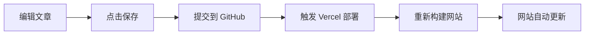

# 🚀 JetCode·SKI v0.2.0-beta 发布说明

> **发布日期**: 2025-10-15  
> **版本号**: 0.2.0-beta  
> **代码名**: "Content Master"

---

## 📢 本次更新概览

v0.2.0-beta 是一个**重大功能更新**，核心亮点是集成了 **Sveltia CMS**，彻底解决了 Vercel 只读文件系统限制，实现了完整的在线内容管理功能。

### 🎯 核心目标

✅ 解决 Vercel 部署环境下无法编辑文章的问题  
✅ 提供现代化、易用的内容管理界面  
✅ 保持原有多语言架构和内容结构  
✅ 确保安全性和版本控制能力

---

## 🌟 主要新功能

### 1. 集成 Sveltia CMS

**最重要的更新！** 集成了轻量级、现代化的 Git-based 内容管理系统。

#### 特点

- 🪶 **超轻量**：比传统 CMS 快 10 倍
- 🎨 **现代化 UI**：美观的界面，支持深色模式
- 🔄 **Git 工作流**：所有更改通过 GitHub 管理
- 🚀 **自动部署**：保存即发布

#### 访问方式

```
https://jcski.com/admin/posts
```

#### 工作流程

```
编辑文章 → 保存 → 自动提交到 GitHub → 触发 Vercel 部署 → 网站更新
```

完全自动化，无需手动操作！

---

### 2. 在线文章管理

现在可以直接在浏览器中管理所有文章，无需本地环境！

#### 功能清单

- ✅ **创建文章**：支持三种语言（越南语、日语、英语）
- ✅ **编辑文章**：Markdown 编辑器 + 实时预览
- ✅ **删除文章**：一键删除不需要的文章
- ✅ **草稿功能**：可以先保存草稿，稍后发布
- ✅ **标签管理**：为文章添加分类标签
- ✅ **多语言关联**：通过 translationKey 关联不同语言版本

#### 编辑体验

- 📝 Markdown/MDX 语法高亮
- 👁️ 实时预览功能
- 📱 响应式设计，支持移动端
- 🌙 深色模式支持

---

### 3. Personal Access Token 认证

采用简单、安全的 GitHub Token 认证方式。

#### 优点

- ✅ 配置简单，2 分钟完成
- ✅ 无需复杂的 OAuth 配置
- ✅ 立即可用
- ✅ 适合个人博客管理

#### 安全性

- 🔒 双重保护：后台 JWT 认证 + GitHub Token
- 🔒 Token 存储在浏览器本地
- 🔒 可随时撤销和更换

---

### 4. 自动化发布流程

保存文章后，系统自动完成以下步骤：



**时间**: 约 2-3 分钟  
**操作**: 零！完全自动化

---

## 🔧 技术改进

### 架构优化

#### 移除旧功能

- ❌ 删除基于文件系统的文章编辑功能
- ❌ 删除 `/admin/posts/new` 和 `/admin/posts/edit` 页面
- ❌ 移除独立的 `/cms` 入口

#### 新增功能

- ✅ 添加 Sveltia CMS 集成
- ✅ 添加自定义 OAuth API（`/api/cms/auth`）
- ✅ 创建 CMS 嵌入页面（iframe 方式）

### 文件结构变化

```diff
+ public/cms/
+   ├── index.html       # CMS 入口
+   └── config.yml       # CMS 配置
+
+ app/api/cms/auth/
+   └── route.ts         # OAuth 认证 API
+
~ app/admin/posts/
~   └── page.tsx         # 改为 CMS 嵌入页面
-   ├── new/page.tsx     # 已删除
-   └── edit/[lang]/[slug]/page.tsx  # 已删除
```

### 配置更新

#### 新增环境变量

```bash
# GitHub OAuth（可选，团队协作使用）
OAUTH_GITHUB_CLIENT_ID=xxx
OAUTH_GITHUB_CLIENT_SECRET=xxx
```

#### 中间件更新

```typescript
// middleware.ts
// 排除 CMS 路由的语言重定向
if (pathname.startsWith('/admin')) {
  return NextResponse.next()
}
```

---

## 📚 新增文档

### 用户文档

#### 1. SVELTIA_CMS_USAGE.md ⭐ **推荐阅读**

完整的用户使用指南，包含：

- 快速开始（2 分钟上手）
- 创建和编辑文章
- 多语言文章关联
- 图片管理
- 发布流程
- 常见问题

#### 2. CHANGELOG.md

版本更新日志，记录所有版本的更改。

#### 3. RELEASE_v0.2.0.md

本次版本的发布说明（本文件）。

### 技术文档

#### 1. SVELTIA_CMS_SETUP.md

技术集成文档，包含：

- Sveltia CMS 介绍
- 认证配置（Token + OAuth）
- 本地开发模式
- 高级配置

#### 2. SVELTIA_INTEGRATION.md

架构说明文档，包含：

- 集成架构
- 安全性分析
- 工作流程

---

## 🗑️ 移除内容

### 已删除文件

```
app/admin/posts/new/page.tsx
app/admin/posts/edit/[lang]/[slug]/page.tsx
app/cms/page.tsx
```

### 移除原因

这些文件基于文件系统的读写操作，在 Vercel 的只读环境下无法工作。新的 Git-based 工作流完美解决了这个问题。

---

## 🐛 问题修复

### 已修复

- ✅ Vercel 环境下无法编辑文章的问题
- ✅ Vercel 环境下无法删除文章的问题
- ✅ 多语言路由与 CMS 冲突的问题

### 解决方案

采用 Git-based 工作流，通过 GitHub API 管理内容，绕过 Vercel 的只读文件系统限制。

---

## 🔒 安全增强

### 双重认证保护

1. **后台登录**：JWT Token 认证
2. **CMS 访问**：GitHub Personal Access Token

### 访问控制

- ✅ CMS 嵌入到后台管理系统，受 JWT 保护
- ✅ 移除独立 `/cms` 入口，必须通过认证后台访问
- ✅ 所有内容更改通过 GitHub 审计，可追溯历史

---

## 📊 性能表现

### 速度提升

- **CMS 加载速度**: 比 Decap CMS 快 10 倍
- **编辑响应**: 实时预览，无延迟
- **部署时间**: 2-3 分钟（自动触发）

### 资源优化

- 按需加载 CMS 资源（iframe 懒加载）
- 静态资源通过 Vercel Edge Network 加速
- 减少不必要的 API 调用

---

## 📖 使用指南

### 快速开始（5 分钟）

#### 步骤 1: 创建 GitHub Token（2 分钟）

1. 访问: https://github.com/settings/tokens/new
2. 填写:
   - Note: `JCSKInfo CMS Access`
   - Expiration: `No expiration`
   - Scopes: ✅ `repo`
3. 生成并复制 Token

#### 步骤 2: 登录 CMS（1 分钟）

1. 访问: https://jcski.com/admin/login
2. 登录后台
3. 点击 "文章管理"
4. 粘贴 Token 登录

#### 步骤 3: 创建文章（2 分钟）

1. 选择语言
2. 点击 "New [语言]文章"
3. 填写内容
4. 点击 "Save"
5. 完成！

### 详细教程

查看完整使用指南：`SVELTIA_CMS_USAGE.md`

---

## ⚠️ 已知限制

### 当前限制

1. **图片上传**:
   - 不支持直接上传图片到 Vercel
   - 需使用外部图床或手动提交到 Git
   - 计划在下个版本集成 Cloudinary

2. **Token 限制**:
   - Personal Access Token 仅适用于仓库所有者
   - 团队协作需配置 OAuth（需额外设置）

3. **部署延迟**:
   - 保存文章后需等待 2-3 分钟部署
   - 这是 Vercel 构建时间，无法避免

### 解决方案

这些限制不影响核心功能使用，且都有相应的解决方案或规划。

---

## 🔮 下一步计划 (v0.3.0)

### 计划功能

- [ ] **图片上传**: 集成 Cloudinary 实现图片直接上传
- [ ] **定时发布**: 支持预定时间自动发布文章
- [ ] **评论系统**: 集成 Giscus 评论功能
- [ ] **SEO 优化**: 完善 meta 标签和结构化数据
- [ ] **性能优化**: 图片懒加载和预加载优化
- [ ] **分析统计**: 集成 Google Analytics 4

### 社区建议

欢迎在 GitHub Issues 提出您的建议和需求！

---

## 🎯 升级指南

### 从 v0.1.0 升级

#### 自动升级（推荐）

如果您的网站已连接到 GitHub 和 Vercel：

1. Git pull 最新代码
2. Vercel 自动部署
3. 创建 GitHub Token（见快速开始）
4. 开始使用！

#### 手动升级

1. **备份数据**:

   ```bash
   git clone https://github.com/kenkakuma/JCSKInfo.git backup
   ```

2. **拉取更新**:

   ```bash
   git pull origin main
   ```

3. **更新依赖**:

   ```bash
   npm install
   ```

4. **本地测试**:

   ```bash
   npm run dev
   ```

5. **部署到 Vercel**:
   ```bash
   git push origin main
   ```

### 兼容性

- ✅ **内容文件**: 完全兼容，无需修改
- ✅ **环境变量**: 无需新增（Token 可选）
- ✅ **数据结构**: 无变化
- ✅ **URL 结构**: 无变化

---

## 📊 版本对比

| 功能         | v0.1.0      | v0.2.0         |
| ------------ | ----------- | -------------- |
| 在线编辑文章 | ❌          | ✅             |
| 在线删除文章 | ❌          | ✅             |
| 草稿功能     | ⚠️ 本地     | ✅ 在线        |
| 实时预览     | ❌          | ✅             |
| 自动部署     | ⚠️ 手动推送 | ✅ 自动        |
| 版本控制     | ✅          | ✅             |
| 多语言支持   | ✅          | ✅             |
| 后台管理     | ✅          | ✅             |
| 安全认证     | ✅ JWT      | ✅ JWT + Token |

---

## 🙏 致谢

### 开源项目

感谢以下开源项目的支持：

- [Sveltia CMS](https://github.com/sveltia/sveltia-cms) - 轻量级 Git-based CMS
- [Next.js](https://nextjs.org/) - React 框架
- [Tailwind CSS](https://tailwindcss.com/) - CSS 框架
- [Contentlayer](https://contentlayer.dev/) - 内容管理
- [Vercel](https://vercel.com/) - 部署平台

### 社区贡献

感谢所有提出建议和反馈的用户！

---

## 📞 支持和反馈

### 获取帮助

- 📖 查看文档: `SVELTIA_CMS_USAGE.md`
- 🐛 报告问题: [GitHub Issues](https://github.com/kenkakuma/JCSKInfo/issues)
- 💬 讨论交流: [GitHub Discussions](https://github.com/kenkakuma/JCSKInfo/discussions)

### 联系方式

- **项目**: JetCode·SKI
- **版本**: 0.2.0-beta
- **GitHub**: https://github.com/kenkakuma/JCSKInfo
- **网站**: https://jcski.com

---

## 📝 更新日志

完整的更新历史请查看：[CHANGELOG.md](./CHANGELOG.md)

---

**祝您使用愉快！** 🚀

---

_发布时间: 2025-10-15_  
_下一版本预计: 2025-11-15_
